# Hi, I'm Maximilian

**DevOps engineer and CS student in Munich** &nbsp;|&nbsp; C# modder for [Kitten Space Agency](https://ahwoo.com/app/100000/kitten-space-agency)

I study computer science and work in DevOps - Linux, Docker, and Kubernetes. In my spare time I build mods in C# / .NET for [Kitten Space Agency](https://ahwoo.com/app/100000/kitten-space-agency)

 

 

## Featured mods

A suite of mods for **[Kitten Space Agency](https://ahwoo.com/app/100000/kitten-space-agency)**

| Mod | What it does |
| --- | --- |
| [**Advanced Flight Computer**](https://github.com/Maximilian-Nesslauer/KSA-AdvancedFlightComputer) | Orbital-mechanics autopilot |
| [**Delta-V Map**](https://github.com/Maximilian-Nesslauer/KSA-DeltaVMap) | Interactive delta-v subway map for planning trips across the solar system |
| [**Measure Tools**](https://github.com/Maximilian-Nesslauer/KSA-MeasureTools) | Click-to-measure ruler and protractor for map view, planet surfaces, and the vehicle editor |
| [**Stage Info**](https://github.com/Maximilian-Nesslauer/KSA-StageInfo) | Stage and sequence info panel |
| [**Auto Stage**](https://github.com/Maximilian-Nesslauer/KSA-AutoStage) | Automatic staging |
| [**Auto-Remove Finished Burns**](https://github.com/Maximilian-Nesslauer/KSA-AutoRemoveFinishedBurns) | Clears completed auto-burns from the burn plan |

## GitHub stats

## Contact

- Email: [dev@max-nesslauer.com](mailto:dev@max-nesslauer.com)
- Location: Munich, Germany
